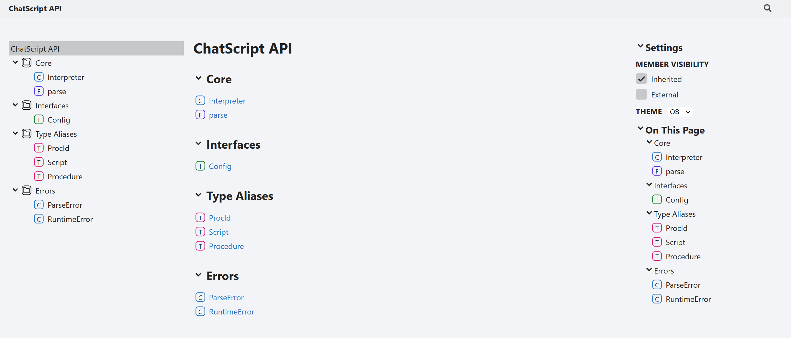
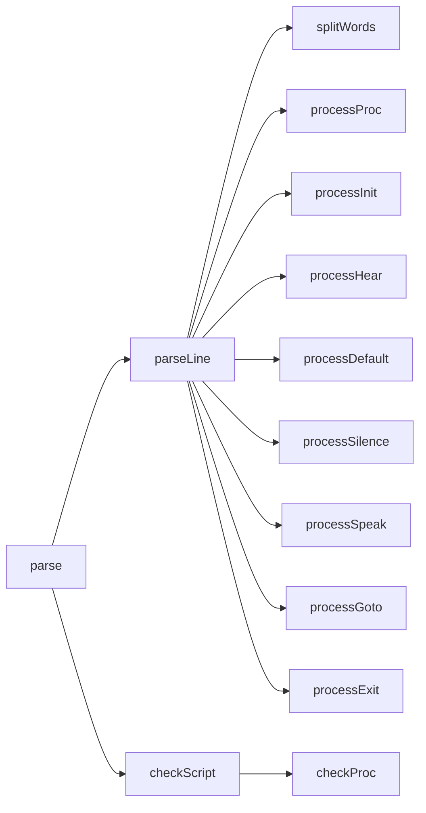
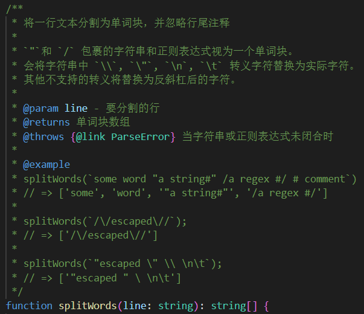
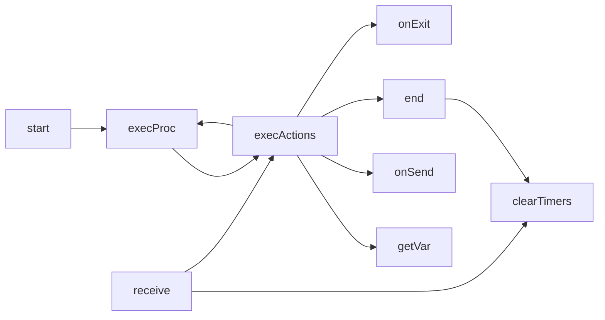
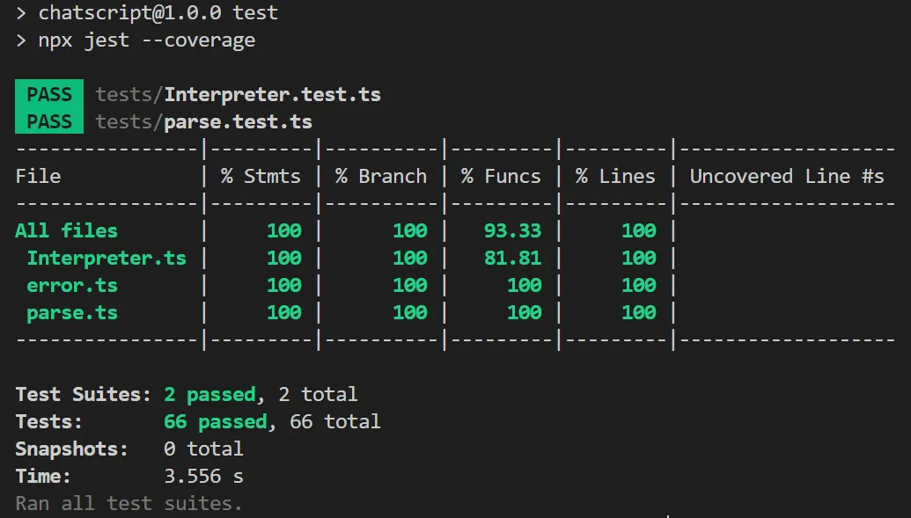
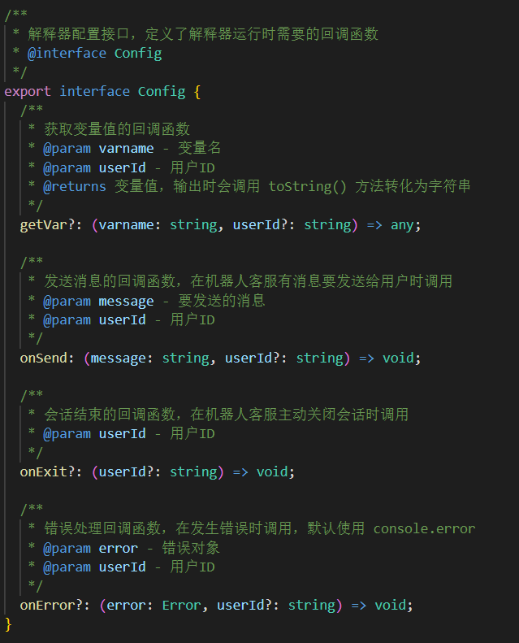
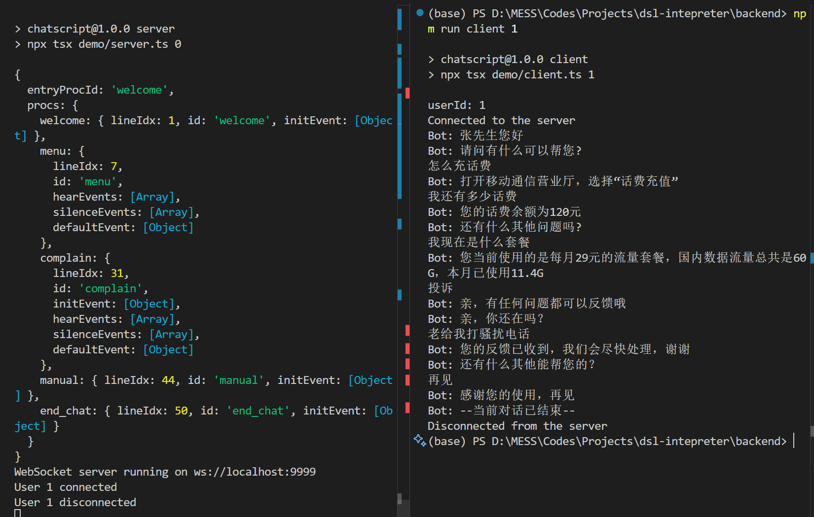
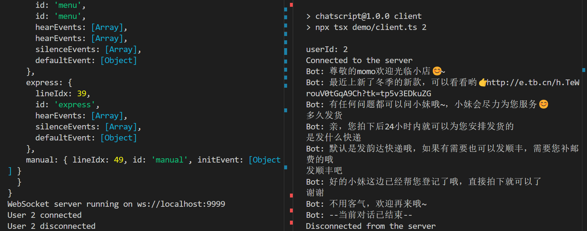

# 领域特定脚本语言解释器{.title}

<info>
<item>姓名：肖子涵</item>
<item>学号：2022211294</item>
<item>班级：2022211301</item>
</info>

# 任务要求

领域特定语言（Domain Specific Language，DSL）可以提供一种相对简单的文法，用于特定领域的业务流程定制。本作业要求定义一个领域特定脚本语言，这个语言能够描述在线客服机器人（机器人客服是目前提升客服效率的重要技术，在银行、通信和商务等领域的复杂信息系统中有广泛的应用）的自动应答逻辑，并设计实现一个解释器解释执行这个脚本，可以根据用户的不同输入，根据脚本的逻辑设计给出相应的应答。

# 概述

本项目设计的客服机器人脚本语言称为 ChatScript，用于描述客服机器人的自动应答逻辑。提供：

- 一个解析函数用于将 ChatScript 脚本转化为语法树
- 一个解释器类用于执行脚本。解释器以状态机为原型，根据不同的输入内容或沉默行为，执行输出、状态转移与结束操作，并向外提供一系列回调函数用于个性化指定获取变量值、发送消息、结束会话、错误处理的方法。

项目使用 TypeScript 编写，核心封装为一个包。此外，提供了[后端命令行 Demo](#Demo)。

# 脚本语法文档

为了便于理解，先给出一段示例脚本。这段脚本描述营业厅机器人客服的逻辑。

## 示例脚本

```
# 入口
PROC welcome
    INIT
        SPEAK $surname $sex "您好"
        SPEAK "请问有什么可以帮您?"
        GOTO menu
# 主菜单
PROC menu
    HEAR /话费充值|(怎么|如何).*话费/ 
        SPEAK "打开移动通信营业厅，选择“话费充值”"
        GOTO menu
    HEAR /话费|余额/
        SPEAK "您的话费余额为" $balance "元"
        SPEAK "还有什么其他问题吗?"
        GOTO menu
    HEAR "套餐"
        SPEAK "您当前使用的是每月" $planPrice "元的流量套餐，国内数据流量总共是" $package "，本月已使用" $usedPackage
        GOTO menu
    HEAR "投诉"
        GOTO complain
    HEAR "转人工"
        GOTO manual
    HEAR "再见"
        GOTO end_chat
    SILENCE 20
        SPEAK "亲，你还在吗？"
    SILENCE 60
        GOTO end_chat
    DEFAULT
        SPEAK "亲，我听不太懂呢，困难的问题您可以转人工试试哦~"
        GOTO menu
# 处理投诉
PROC complain
    INIT
        SPEAK "亲，有任何问题都可以反馈哦"
    HEAR /.+/
        SPEAK "您的反馈已收到，我们会尽快处理，谢谢"
        SPEAK "还有什么其他能帮您的？"
        GOTO menu
    SILENCE 20
        SPEAK "亲，你还在吗？"
    SILENCE 60
        GOTO end_chat
    DEFAULT
        GOTO menu
# 转人工
PROC manual
    INIT
        SPEAK "正在为您转到人工...请稍后..."
        SPEAK "转接人工失败，请稍后再试"
        GOTO menu
# 结束会话
PROC end_chat
    INIT
        SPEAK "感谢您的使用，再见"
        EXIT
```
注意：ChatScript 不要求缩进，但语句必须换行。


## 词法元素

ChatScript 的词法元素定义如下：

- **关键字（keyword）**：关键字位于一行的行首，指示语句（Statement）的类型。关键字包括：`PROC`、`INIT`、`HEAR`、`DEFAULT`、`SILENCE`、`SPEAK`、`GOTO`、`EXIT`。**不区分大小写**。

- **标识符（identifier）**：用于区分不同过程。要求字母或下划线开头，由数字、字母或下划线组成。
- **变量（variable）**：`$` 开头，后面为变量名。变量名要求字母或下划线开头，由数字、字母或下划线组成。如 `$abc_2`。
- **数字（number）**：0-9 构成的十进制整数。
- **字符串（string）**：由双引号包裹的任意串。
  
  如果字符串内需要包括双引号`"`本身，请使用反斜杠转义：`\"`。其他支持的转义字符有 `\t`, `\n`, `\\`。
  
  不支持的转义字符将替换为反斜杠后一个字符，如 `\x` 将替换为 `x`。
- **正则表达式（regex）**：与 JavaScript/TypeScript 中正则表达式字面量规则一致。
- **注释（comment）**：`#` 后面的内容会被当作注释忽略，可以独占一行，也可以在一行末尾。


## 脚本结构

一个 ChatScript 脚本由多个 **过程（procedure）** 组成，每个过程包含多个**事件（event）**，每个事件包含多个处理**动作（action）**。

### 过程

语法：
```
PROC <identifier>
```
过程名称不能相同。

**入口过程**是脚本运行后第一个执行的过程。默认脚本中第一个定义的过程为入口过程。

### 事件

- **`InitEvent`**
  
  开始执行该过程时触发。每个过程只能有一个 `InitEvent`。
  
  语法：
    ```
    INIT
    ```
- **`HearEvent`**
  
  参数是一个字符串或者正则表达式。当用户输入包含字符串，或与正则表达式匹配时触发。每个过程可以有多个 `HearEvent`。如果输入匹配多个规定模式，执行**最先出现**的 `HearEvent`。

  语法：
    ```
    HEAR <string>|<regex>
    ```

- **`DefaultEvent`**
  
  在**用户有输入**的情况下，输入不匹配任何 `HearEvent` 时触发。每个过程只能有一个 `DefaultEvent`。

  语法：
    ```
    DEFAULT
    ```

- **`SilenceEvent`**
  
  进入该过程后，在指定时间内用户无输入时触发。参数为无输入的秒数。
  
  语法：
    ```
    SILENCE <number>
    ```

  每个过程可以有多个 `SilenceEvent`，随时间流逝依次执行。如下面 `SilenceEvent` 序列将在无输入第 5 秒发送“亲，你还在吗”，在第20秒结束会话。
    ```
    silence 5
        speak "亲，你还在吗"
    silence 20
        exit
    ```
    
不同类型的事件定义的顺序不影响脚本执行，但为了便于理解，推荐按照 InitEvent、HearEvent、DefaultEvent、SilenceEvent 的顺序依次定义。

### 动作

- **`SpeakAction`**
  
  向用户发送一条消息。连续的多个 `SpeakAction` 将表现为多条消息。

  参数可以是一个及以上字符串或变量，由空格分隔。变量值将调用 `toString()` 方法转化为字符串后拼接发送。
  
  语法：
    ```
    SPEAK (<string>|<variable>)+
    ```
  如下面的 `SpeakAction` ，假设变量 `$a` 的值 1, `$b` 的值为 2，将发送“ab=12;”
    ```
    speak "ab=" $a $b ";"
    ```

- **`GotoAction`**
  
  转移到某个过程。转移后原过程未执行的动作和事件将不会再执行。

  参数为过程标识符。
  
  语法：
    ```
    GOTO <identifier>
    ```
- **`ExitAction`**
  
  结束会话。结束后当前过程未执行的动作和事件将不会再执行。
  
  语法：
    ```
    EXIT
    ```

动作**根据定义的顺序依次执行**。如果 `GotoAction` 或 `ExitAction` 后定义了动作，那么这些动作实际上不会执行。

### 特殊规定

为了防止过程卡死，ChatScript 会对过程进行安全检查，以保证一个过程能够转移或结束。特别要求：

- 如果过程定义了 `HearEvent`（即过程需要接收用户输入），则必须定义 `DefaultEvent` 和 `SilenceEvent`，以应对用户没有按预期输入的情况。
  
  并且，每个 `HearEvent` 和 `DefaultEvent` 必须包含 `GotoAction` 或 `ExitAction`。至少有一个`SilenceEvent` 包含 `GotoAction` 或 `ExitAction`。

- 如果过程没有定义 `HearEvent`（即过程不需要接收用户输入），则 `InitEvent` 必须定义 `DefaultEvent` 和 `SilenceEvent`。


# 接口文档

本项目使用 TypeDoc 将注释生成接口文档，可以在 `ChatScript/docs` 下方便地查看和搜索 API 信息。运行 `npm run doc` 即可生成文档。




## 类型定义

#### **ProcId**: `string`
过程标识符类型

#### **Script**: `object`

脚本对象，描述客服机器人逻辑

**属性**：

- **entryProcId**: [`ProcId`](#procid-string)
  入口过程 ID
- **procs**: `Record`<[`ProcId`](#procid-string), [`Procedure`](#procedure-object)>
  脚本包含的所有过程


#### **Procedure**: `object`

过程对象

**属性**：

- **lineIdx**: `number` 
  过程定义在源代码中的行号
- **id**: [`ProcId`](#procid-string)
  过程的唯一标识符
- **initEvent?**: `InitEvent`
  初始化事件
- **hearEvents?**: `HearEvent[]`
  听取用户消息的事件列表
- **defaultEvent?**: `DefaultEvent`
  默认事件，当没有匹配的hear事件时触发
- **silenceEvents?**: `SilenceEvent[]`
  沉默事件列表，当用户一定时间没有响应时触发


## parse 函数

将 ChatScript 脚本文本解析为脚本对象
```ts
parse(script: string): Script
```


#### 参数

- **script**: `string` 要解析的脚本文本

#### 返回值

[`Script`](#script-object) 解析后的脚本对象


## Config 接口

解释器配置接口，定义了解释器运行时需要的回调函数

#### 属性

- **getVar?**: (`varname`, `userId`?) => `any`
  获取变量值的回调函数
  - **varname**: `string` 变量名
  - **userId?**: `string` 用户ID
  - **返回值**: `any` 变量值，输出时会调用 `toString()` 方法转化为字符串

- **onSend**: (`message`, `userId`?) => `void`
  发送消息的回调函数，在机器人客服有消息要发送给用户时调用
  - **message**: `string` 要发送的消息
  - **userId?**: `string` 用户ID
  - **返回值**: `void`

- **onExit?**: (`userId`?) => `void`
  会话结束的回调函数，在机器人客服主动关闭会话时调用
  - **userId?**: `string` 用户ID
  - **返回值**: `void`

- **onError?**: (`error`, `userId`?) => `void`
  错误处理回调函数，在发生错误时调用，默认使用 console.error
  - **error**: `Error` 错误对象
  - **userId?**: `string` 用户ID
  - **返回值**: `void`

## Interpreter 类

ChatScript 解释器类，用于执行对话脚本

#### 实现

- [`Config`](#config-接口)

#### 属性

- **curProc**: [`Procedure`](#procedure-object)
  当前执行的过程
- **isRunning**: `boolean` = `false`
  会话是否正在运行
- **userId?**: `string`
  该实例对应的用户标识符，将传入回调函数作为参数
- **getVar**: (`varname`, `userId`?) => `any`
- **onSend**: (`message`, `userId`?) => `void`
- **onExit**: (`userId`?) => `void`
- **onError**: (`error`, `userId`?) => `void`

#### 构造器
```typescript
Interpreter(script, config, userId?): Interpreter
```

创建一个新的解释器实例

**参数**：

- **script**: [`Script`](#script-object) 要执行的脚本
- **config**: [`Config`](#config-接口) 配置对象，包含回调函数
- **userId?**: `string` 用户ID，机器人客服会在调用上述方法时带上初始传入的 userId。没有传入则为 undefined

#### 方法

- **start**

    ```typescript
    start(fromProcId): Promise<void>
    ```

    从指定过程开始执行会话

    如果对已经结束的会话调用该方法，会重新开始会话。如果对正在进行的会话调用该方法，会抛出 RuntimeError

    **参数**：

    - **fromProcId**: `string`
    起始过程ID，默认从 entryProcId 开始

- **receive**
  
    ```typescript
    receive(message): Promise<void>
    ```

    接收并处理用户消息

    等待用户消息。收到消息后根据消息内容继续执行对应 HearEvent 或 DefaultEvent 的事件序列

    **参数**：
    - **message**: `string` 用户发送的消息

- **end**
  
    ```typescript
    end(): void
    ```

    结束当前会话，清除所有定时器并将运行状态设为 false


## 错误

### ParseError

解析错误类，用于表示脚本解析过程中发生的错误

#### 继承

- `Error`

#### 构造器
```ts
ParseError(line, message): ParseError
```

- **line**: `number` 错误发生的行号
- **message**: `string` 错误信息
- **返回值**: [`ParseError`](#parseerror)

#### 属性

- **line**: `number` 错误发生的行号
### RuntimeError

运行时错误类，用于表示脚本执行过程中发生的错误

#### 继承

- `Error`

#### 构造器
```ts
RuntimeError(line, message): RuntimeError
```

- **line**: `number` 错误发生的行号
- **message**: `string` 错误信息
- **返回值**: [`RuntimeError`](#runtimeerror)

#### 属性

- **line**: `number` 错误发生的行号


# 设计与实现

项目分为解析器和解释器两个主要部分:

1. **解析器(`parse.ts`)**: 将 ChatScript 文本解析为语法树
2. **解释器(`Interpreter.ts`)**: 执行语法树中的指令

此外还有类型定义(`type.ts`)和错误处理(`error.ts`)两个辅助模块。

[接口文档](#接口文档)中没有包括的类型定义如下。过程、事件和动作的类型结构都包括 `lineIdx` 便于定位错误发送位置，提供更好的用户体验。事件类型包含属性 `hasExitOrGoto` 用于标记此事件是否包括 `GotoAction` 或 `ExitAction`，便于检查过程是否能转移或退出（见[脚本语法文档-特殊规定](#特殊规定)）

```ts
/** 事件类型 */
export type ProcEvent = InitEvent | HearEvent | SilenceEvent | DefaultEvent;

type EventCommon = {
  lineIdx: number;
  type: string;
  actions: Action[];
  hasExitOrGoto: boolean; // 该事件是否会终止或转移
};
type InitEvent = { type: 'InitEvent' } & EventCommon;
type HearEvent = { type: 'HearEvent'; pattern: string | RegExp } & EventCommon;
type DefaultEvent = { type: 'DefaultEvent' } & EventCommon;
type SilenceEvent = { type: 'SilenceEvent'; timeout: number } & EventCommon;

/** 动作类型 */
export type Action = SpeakAction | GotoAction | ExitAction;

type SpeakAction = {
  lineIdx: number;
  type: 'SpeakAction';
  tokens: Token[];
};
type GotoAction = {
  lineIdx: number;
  type: 'GotoAction';
  procId: ProcId;
};
type ExitAction = {
  lineIdx: number;
  type: 'ExitAction';
};

/**
 * SPEAK 语句参数类型
 */
export type Token = {
  type: 'string' | 'variable';
  content: string; // 内容为字符串或者变量名（不包含 $ 符号）
};
```

## 解析器

解析器实现了 ChatScript 文本到语法树的转换。
`parse` 中重要的变量如下：
- `lineIdx`：当前行号，便于错误输出
- `procs`: 记录构造的所有过程
- `entryProcId`: 记录入口过程
- `curProc`: 指向当前正在解析的过程
- `curEvent`: 指向当前正在解析的事件
- `referedProcIds`: 记录下被 GOTO 语句引用的过程，便于最后检查过程是否定义

函数调用关系图如下：



首先 `parse` 按行读入文本，将每一行内容传入 `parseLine`，`parseLine` 去除每一行的首尾空白符，忽略空行和注释行，然后将行传入 `splitWords` 分割词法元素，并且处理字符串元素的转义。分割规则在 `splitWords` 函数的注释已经写的非常清晰：



得到分割的词法元素后根据第一个元素，即关键字，区分区域类型，并调用相应的解析函数 `process...` 。每个解析函数内首先判断参数数量是否正确，然后通过正则表达式检查参数格式是否正确。不正确则抛出 ParseError 错误。PROC, INIT, DEFAULT 语句需要检查是否重复定义。

- 对 `processProc`，则构造 Procedure 对象存入 `procs`，并且修改 `curProc` 指向为自己，`curEvent` 置空。

  ```ts
    function processProc(args: string[]): void {
      if (args.length < 1) throw new ParseError(lineIdx, 'Missing parameter for PROC statement');
      if (args.length > 1) throw new ParseError(lineIdx, 'Too many parameters for PROC statement');

      if (!procIdPattern.test(args[0]))
        throw new ParseError(lineIdx, `Porcedure name "${args[0]}" is invalid`);
      const procId = args[0];
      if (procs[procId])
        throw new ParseError(lineIdx, `Duplicate definition of Procedure "${procId}"`);

      const newProc: Procedure = {
        lineIdx: lineIdx,
        id: procId,
      };
      if (Object.keys(procs).length === 0) entryProcId = procId;
      procs[procId] = newProc;
      curProc = newProc; // 切换到当前 proc
      curEvent = null;
    }
  ```

- 对 `processInit`, `processHear`, `processDefault`, `processSilence`，构造相应事件对象存入当前过程，并修改 `curProc` 指向自己。

- 对 `processSpeak`, `processGoto`, `processExit`，构造相应动作对象存入当前事件。

构造完成后，最后调用 `checkScript` 对脚本进行整体检查，以发现顺序解析中无法发现的错误。包括检查脚本是否为空、调用 `checkProc` 检查每个过程的结构是否满足语法的[特殊规定](#特殊规定)、GOTO 语句引用的过程后是否定义。

## 解释器

解释器基于状态机模型实现。每一个 Interpreter 实例负责根据脚本执行一个用户运行时实例，由于需要包含超时事件的管理，因此不能简单设置成 一条用户输入-一条客服输出 的接口形式。同时为了保持解释器模块与其他业务模块之间的独立性，Interpreter 被设计成可以通过传入不同的可选回调函数来配合不同业务的形式。在这种形式下，脚本也可以支持一条用户输入对应多条客服输出的模式，增加 ChatScript 的灵活性。同时为了便于一个脚本上运行多个用户运行时实例，每个 Interpreter 实例可以传入 `userId` 用于区分不同用户运行时实例，供其他业务逻辑使用。

可以自定义的回调函数如下：

- `getVar?: (varname: string, userId?: string) => any`
  
  在需要将变量解析为变量值时调用。
  
  Interpreter 没有采用初始化时传入所有变量表的实现方法，是因为在许多场景下没必要一次性加载所有需要的变量。使用回调函数可以按需获取，实际业务中可以根据需要进行数据库查询等。

- `onSend: (message: string, userId?: string) => void`
- `onExit?: (userId?: string) => void`
- `onError?: (error: Error, userId?: string) => void`

可选回调函数的更多信息参见[Config 接口](#config-接口)。

Interpreter 的 API 接口文档参见[Interpreter 类](#interpreter-类)。

Interpreter 类其他成员变量如下：

- `script`：解析过的脚本
- `curProc`：当前执行的过程
- `timers`：存储当前过程 `SilenceEvents` 触发的定时器。
- `isRunning`：标记会话是否在运行。当调用 `start` 方法后会话开始运行，调用 `end` 方法或脚本执行 `ExitAction` 后会话结束。用于约束方法的调用时机。

Interpreter 类方法之间调用关系如下：



使用 `start` 方法启动会话后，`start` 根据入口过程设置 `curProc`，然后调用 `execProc` 执行该过程。

`execProc` 首先调用 `execActions` 执行 InitEvent（如果存在），然后设置 `SilenceEvents` 的定时器，如果没有用户输入，将在指定时间后调用 `execActions` 执行对应事件。之后程序等待外部调用 `receive` 传入用户输入。

获取用户输入后清除所有定时器防止 SilenceEvent 执行。并根据用户输入调用 `execActions` 执行对应的 HearEvent 或 DefaultEvent 的事件序列。

`execActions` 依次执行事件序列。SPEAK 语句调用 `getVar` 获取变量值，调用 `onSend` 回调发送消息。GOTO 语句和 EXIT 语句执行后将直接返回，不再执行后续动作。GOTO 更改当前过程为转移过程，并调用 `execProc` 执行。EXIT 调用 `end` 进行清理，并调用回调 `onExit` 通知外部此会话已结束。

此外，`start`, `receive`, `execProc`, `execActions` 使用异步函数设计，防止递归导致栈溢出。


# 测试

使用了 Jest 测试框架进行单元测试。测试文件位于 `ChatScript/tests` 目录下，分别对模块 `parse.ts` 和 `Interpreter.ts` 进行了单元测试。使用 describe 块合理分组，测试用例功能一目了然。测试用例实现了100%的代码覆盖率，包括了各种边界情况。

## 测试内容

#### `parse.test.ts`

- 词法分析
  - 空文本、注释、转义处理
  - 字符串、正则表达式闭合检查
  - 变量语法检查
 
- 语法分析
  - 各类语句参数检查（参数缺失、多余、格式无效）
  - 重复定义检查（PROC、INIT、DEFAULT）
  - 过程定义前置检查
  - 事件定义前置检查
  
- 结构检查
  - HearEvent 对 DefaultEvent 和 SilenceEvent 的依赖
  - 各类事件是否包含对 ExitAction 或 GotoAction
  - GOTO 目标过程是否定义

#### `Interpreter.test.ts`

- 一个基本脚本的执行。分别测试各个状态的执行结果和状态间转移。
- 传入脚本有错误的情况
- 变量的处理
- 外部在不正确时机调用方法
- 外部结束会话
- 默认回调

## 测试桩的使用

解释器依赖多个外部回调函数，包括：
- `getVar`: 获取变量值
- `onSend`: 发送消息
- `onExit`: 结束会话
- `onError`: 错误处理

为了隔离这些外部依赖，测试中使用 Jest 的 mock 函数替换这些回调。这样可以：
1. 验证回调函数是否被正确调用
2. 检查调用参数是否符合预期
3. 模拟外部依赖的返回值
4. 避免测试过程中实际发送消息

```typescript
// 便于创建 Interpreter 实例
function createInterpreter(script: Script, variables: Record<string, any> = {}) {
  // 初始化回调函数的mock
  getVarMock = jest.fn((name: string) => variables[name]);
  onSendMock = jest.fn();
  onExitMock = jest.fn();
  onErrorMock = jest.fn();
  return new Interpreter(
    script,
    {
      getVar: getVarMock,
      onSend: onSendMock,
      onExit: onExitMock,
      onError: onErrorMock,
    },
    userId
  );
}
```


对于涉及时间的测试，使用 Jest 的定时器模拟功能。由于 `Interpreter` 的测试包含异步方法，使用 Jest 异步函数 `jest.advanceTimersByTimeAsync` 保证快进时间后异步操作执行完成。

```typescript
jest.useFakeTimers();  // 使用模拟定时器
await jest.advanceTimersByTimeAsync(10000);  // 快进10秒
```

## 测试结果

在 `ChatScript` 目录下运行 `npm run test` 即可运行测试。测试结果如下：



测试覆盖率达到100%，`Interpreter.ts` 中其他覆盖率均为 100%，函数覆盖率不为 100% 的原因是空函数没有被执行，与程序和测试设计无关。

# 代码规范

使用了 Prettier 进行代码规范和风格的检查和格式化。配置如下：

- 缩进为2个空格
- 语句结尾使用分号
- 大括号不换行
- 使用单引号
- 单行长度不超过100个字符
- 最后一个列表项后不加逗号
- 类型使用大驼峰命名，其他- 标识符使用小驼峰命名
- 使用 JSDoc 注释风格

以 Config 接口为例：



# Demo

首先确保已安装 Node.js，运行 `npm install` 安装相关依赖。

`demo` 目录下 `examplesTexts.ts` 和 `userData.ts` 提供了两个不同的脚本样例和对应的用户数据。

本 Demo 使用 WebSocket 进行服务端与客户端的双向通信，支持多个用户同时聊天，可以扩展为网页应用。

在 `demo` 下运行 `npm run server <test-id>` 启动服务端，`<test-id>`为运行的示例编号，可为 0 或 1，运行 `npm run client <user-id>` 启动客户端，`<user-id>` 为进入会话的用户 id，可为 1 或 2。

## 脚本样例 1

脚本：
```
PROC welcome
    INIT
        SPEAK $surname $sex "您好"
        SPEAK "请问有什么可以帮您?"
        GOTO menu
# 主菜单
PROC menu
    HEAR /话费充值|(怎么|如何).*话费/ 
        SPEAK "打开移动通信营业厅，选择“话费充值”"
        GOTO menu
    HEAR /话费|余额/
        SPEAK "您的话费余额为" $balance "元"
        SPEAK "还有什么其他问题吗?"
        GOTO menu
    HEAR "套餐"
        SPEAK "您当前使用的是每月" $planPrice "元的流量套餐，国内数据流量总共是" $package "，本月已使用" $usedPackage
        GOTO menu
    HEAR "投诉"
        GOTO complain
    HEAR "转人工"
        GOTO manual
    HEAR "再见"
        GOTO end_chat
    SILENCE 20
        SPEAK "亲，你还在吗？"
    SILENCE 60
        GOTO end_chat
    DEFAULT
        SPEAK "亲，我听不太懂呢，困难的问题您可以转人工试试哦~"
        GOTO menu
PROC complain
    INIT
        SPEAK "亲，有任何问题都可以反馈哦"
    HEAR /.+/
        SPEAK "您的反馈已收到，我们会尽快处理，谢谢"
        SPEAK "还有什么其他能帮您的？"
        GOTO menu
    SILENCE 20
        SPEAK "亲，你还在吗？"
    SILENCE 60
        GOTO end_chat
    DEFAULT
        GOTO menu
PROC manual
    INIT
        SPEAK "正在为您转到人工...请稍后..."
        SPEAK "转接人工失败，请稍后再试"
        GOTO menu
# 结束会话
PROC end_chat
    INIT
        SPEAK "感谢您的使用，再见"
        EXIT

```
运行效果（左侧服务端，右侧客户端）：


## 脚本样例2
脚本：
```
# 进入聊天
proc hello
    init
        speak "尊敬的" $username "欢迎光临小店😊~"
        speak "最近上新了冬季的新款，可以看看哟👉http://e.tb.cn/h.TeWrouV0tGqA9Ch?tk=tp5v3EDkuZG"
        speak "有任何问题都可以问小妹哦~，小妹会尽力为您服务😊"
        goto menu

# 主菜单
proc menu
    hear /(什么时候|多久)发货/
        speak "亲，您拍下后24小时内就可以为您安排发货的"
        goto menu
    hear "什么快递"
        speak "默认是发韵达快递哦，如果有需要也可以发顺丰，需要您补邮费的哦"
        goto express
    hear /(什么时候|多久)到货/
        speak "亲，一般韵达发货以后3天左右可以到货的，您收到货以后可以仔细检查一下，如有任何质量问题，7天内可以无条件退换货的，邮费也是我们承担。"
        goto menu
    hear /退货|退款|转人工/
        speak "亲亲这边是遇到了什么问题吗，小妹先帮你转售后客服哦"
        goto manual
    hear /谢谢|感谢/
        speak "不用客气，欢迎再来哦~"
        exit
    hear /再见|拜拜/
        speak "再见，欢迎再来哦~"
        exit
    silence 20
        speak "亲，您还在吗？有任何问题随时找小妹哦🥺~"
    silence 60
        exit
    default
        speak "这个小妹不太懂呢"
        goto menu

# 快递
proc express
    hear "顺丰"
        speak "好的小妹这边已经帮您登记了哦，直接拍下就可以了"
        goto menu
    silence 30
        goto menu
    default
        goto menu

# 转人工服务
proc manual
    init
        speak "正在转售后客服中...这段时间请不要离开哦🙏"
        goto menu
```

运行效果（左侧服务端，右侧客户端）：


<script src="D:/MESS/Codes/Projects/md-report/preview/toc.js"></script>
<script> addToc();</script>